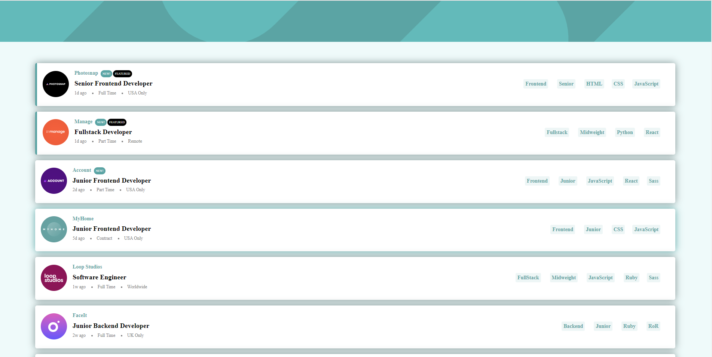

# Job listings with filtering solution using Vue.js and Fetch API

This is a solution to the [Job listings with filtering challenge on Frontend Mentor](https://www.frontendmentor.io/challenges/job-listings-with-filtering-ivstIPCt).

## Table of contents

- [Job listings with filtering solution using Vue.js and Fetch API](#job-listings-with-filtering-solution-using-vuejs-and-fetch-api)
  - [Table of contents](#table-of-contents)
  - [Overview](#overview)
    - [The challenge](#the-challenge)
    - [Screenshot](#screenshot)
      - [Desktop](#desktop)
    - [Links](#links)
  - [My process](#my-process)
    - [Built with](#built-with)
    - [My Solution (In-Depth)](#my-solution-in-depth)
    - [What I Learned](#what-i-learned)
    - [Useful resources](#useful-resources)
  - [Author](#author)

## Overview

### The challenge

Users should be able to:

- View the optimal layout for the site depending on their device's screen size
- See hover states for all interactive elements on the page
- Filter job listings based on the categories

### Screenshot


#### Desktop



### Links

- Solution: [Click to view](https://github.com/phoebe-michel/static-job-listings-master)
- Live Site: [Click to view](https://phoebe-michel.github.io/static-job-listings-master/)

## My process

### Built with

- Semantic HTML5 markup
- CSS custom properties
- Flexbox
- CSS Grid
- Mobile-first workflow
- [Vue.js](https://vuejs.org/) - JS library

### My Solution (In-Depth)

- Using the JavaScript Fetch API, I loaded the job listing data and saved it to an array, `jobList`.

  ```js
  loadDataFromJson: async function () {
    let url = "./data.json";

    await fetch(url)
    .then(async (response) => {
      this.jobList = await response.json();
    })
    .catch((error) => console.log(error));
  },
  ```

- The visibility of the filter bar is based on the length of the array, `jobFilters`. 

  ```html
  <div class="job-list-filter" v-show="jobFilters.length>0"> 
    ...
  </div>
  ```
  On initial load, the `jobFilters` array is empty and, as a result, the filter bar is hidden. When a user clicks on the filter tabs on the right side of each job listing, the addFilter() method is invoked which checks to see if the filter already exists in `jobFilters`. If not, the value is stored in the array and the filter bar becomes visible.

  ```js
  addFilter: function (filter) {
    var filterExists = this.jobFilters.includes(filter);
    if (!filterExists) {
      this.jobFilters.push(filter);
    }
  },
  ```

- The jobList is rendered to the webpage using a computed property, `filteredJobList`. On initial load, all job listings are rendered since the user hasn't clicked on any filters yet. However, when the user clicks on a filter, the program uses the array methods, `.filter()` and `.every()`, to loop through `jobList` and display only the jobs that match the filters in `jobFilters` array.

  ```js
  filteredJobList: function () {
      return this.jobList.filter((job) => {
        let items = [job.role, job.level, ...job.languages, ...job.tools];
        let filters = this.jobFilters;
        return filters.every((filter) => items.includes(filter));
      });
    },
  ```

### What I Learned

This challenge was a great way to refamiliarize myself with array helper methods such as `.every()`, and with using the Fetch API. I was also able to use CSS Grid and FlexBox to get the desired layout, which is always fun.

### Useful resources

- [JavaScript Tutorial - JavaScript Fetch API](https://www.javascripttutorial.net/web-apis/javascript-fetch-api/)
- [Learn CSS Grid](https://learncssgrid.com/)
- [A Complete Guide to CSS Flexbox](https://css-tricks.com/snippets/css/a-guide-to-flexbox/)

## Author

- Website - [Phoebe Michel](https://github.com/phoebe-michel)
- Frontend Mentor - [@awkwardblackcoder](https://www.frontendmentor.io/profile/awkwardblackcoder)
